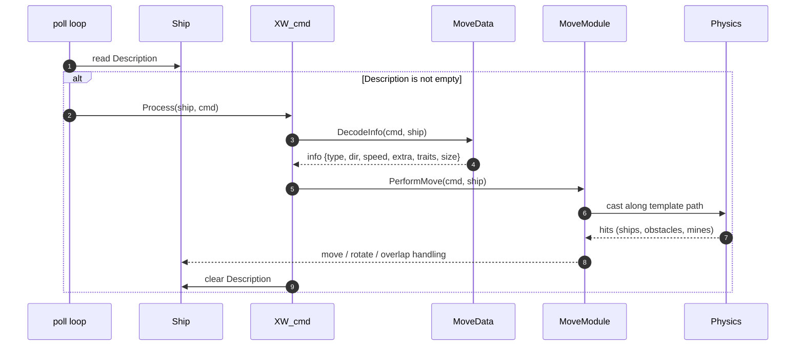
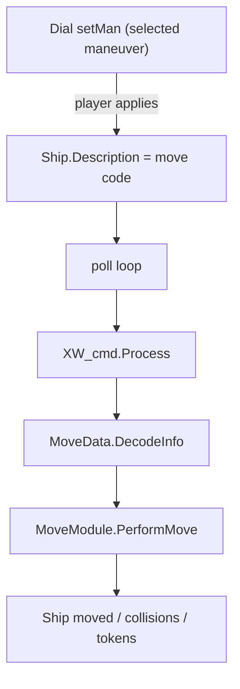
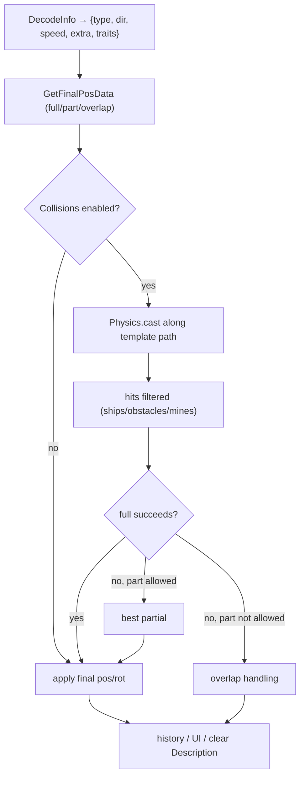

# Movement (as-is): Dial → XW_cmd → MoveData → MoveModule

This system moves ships by writing a **command string** into the ship’s **Description** (e.g., `rr`, `rl2`, `vrf1`,
`vteb3`). A lightweight loop polls ships and dispatches recognized commands to the movement engine. Dials ultimately
feed the same pipeline.

---

## 1) Poll loop → Command Dispatch

Every tick (in `Global.lua`), all `Ship` objects are scanned. If a ship’s Description is non-empty, we call:

`XW_cmd.Process(ship, description)`

`XW_cmd` keeps a registry of **regex → type** entries. The dispatcher:

1) Normalizes/identifies the command (`XW_cmd.CheckCommand`)
2) Decodes semantics (`MoveData.DecodeInfo`)
3) Executes the movement (`MoveModule.PerformMove`)

---

## 2) What Dials Do

* Dials are managed separately (assignment/cleanup in DialManager); when a dial is **peeked/revealed**, the code uses
  `MoveData.DecodeInfo` to print a readable maneuver (speed + type + dir + extras).
* When a dial selection is **applied** to a ship, the corresponding
  **move code** is written to the **ship’s `Description`**, and the same
  poll/dispatch pipeline performs the move.

---

## 3) Command Registry (regex → type)

The movement-relevant entries currently registered in `Global.lua`:

### Core maneuvers (`type = "move"`)

* `[sk][012345][r]?`
  Straights / Koiograns / Stationary (speed `0..5`; optional `r` = reverse for straights)
* `b[rle][0123][strz]?`
  Banks (dir `r|l|e`; speed `0..3`; suffixes like `s`=segnor, `t`=talon, `r`=reverse, `z`=stop, etc.)
* `t[rle][01234][srfbtz]?[t]?`
  Turns (dir `r|l|e`; speed; optional suffix: `s`=segnor, `t`=talon, `r`=reverse, `f`=forward, `b`=backward, `z`=stop)

### Action rolls/boost/decloak/etc. (`type = "actionMove"`)

* `r[r|l|e][123]?`
  **Barrel roll (new form)** — right/left/edge; optional distance `1..3`
* `v[r|l|e][f|b][123]?`
  **StarViper roll (bank template)** — forward/back + optional distance
* `vt[r|l|e][f|b][123]?`
  **StarViper turn-template roll** — forward/back + optional distance
* `x[r|l|e][fb]?` - Legacy/alternate barrel roll shorthand
* `s[12345]b`, `b[r|l|e][123]b`, `t[r|l|e][123]b`
  **Boost** straight/bank/turn
* `a[12]`
  **Adjust** small offsets
* `c[srle][123]?`, `e[srle][fbrle][123]?`, and decloak variants
  **Decloak/Echo decloak** and related rolls/straights

*(There are additional action patterns in the table; the list above shows the primary movement-related ones you’ll
encounter.)*

> **Note on `e` direction**: Throughout decoding, `e` is treated as **left**.

---

## 4) Decoding Semantics (`MoveData.DecodeInfo`)

`MoveData.DecodeInfo(cmd, ship)` produces a normalized `info`:

* `info.type` — e.g., `straight`, `bank`, `turn`, `roll`, `viperF`, `viperB`, `viperTurnF`, `viperTurnB`, `deCloak`, …
* `info.dir` — `left` / `right` (with `e` interpreted as `left`)
* `info.speed` — integer (0..5 depending on command)
* `info.extra` — e.g., `koiogran`, `segnor`, `talon`, `reverse`, `forward`, `backward`
* `info.traits.full` / `info.traits.part` — whether **full** and/or **partial** execution is allowed
* `info.size` — ship base size (affects geometry)
* `info.note` / `info.collNote` — user-facing messages

**Barrel roll (`r...`)**

* `type = "roll"`, `traits.full = true`, `traits.part = false`
* Distance mapping: `1 = forward`, `2 = straight`, `3 = backward` (affects note/collNote)

**Viper roll (`v...`)**

* `type = "viperF"` or `"viperB"` based on `f/b`
* `traits.full = true`, `traits.part = false`
* Distance `1/2/3` adjusts message (forward/straight/backward)

**Viper turn-template roll (`vt...`)**

* `type = "viperTurnF"` or `"viperTurnB"`; `traits.full = true`, `traits.part = false`

**Banks/Turns**

* Allow **partial** execution (`traits.part = true`) when appropriate; K-turn/Talon/Segnor are reflected via `extra`.

---

## 5) Execution and Collisions (`MoveModule`)

### Final position selection

`MoveModule.GetFinalPosData(cmd, ship, ignoreCollisions)` chooses one of:

* **Full** move (preferred if `traits.full` and path is clear)
* **Best partial** move (if full collides and `traits.part` is true)
* **Overlap** (leave the ship; announce bump)

### Collision casting

* Build the template path (straight/bank/turn/roll/viper/vt) according to `info` and base size.
* Use **`Physics.cast(...)`** with prepared casts:

    * Base + nubs (e.g., `nubFL`, `nubFR`, `nubBL`, `nubBR`)
    * Template path slices sized to the maneuver/template geometry
* Filter hits by **selection helpers** (ships, obstacles, mines).
* Detect earliest collision; compute **margin** and viable **partial** segment if allowed.

### Apply / finalize

`MoveModule.PerformMove(cmd, ship)`:

* Calls `GetFinalPosData(...)`, then moves/rotates the ship (or handles overlap).
* Adds history entries, applies UI/buttons (e.g., **BUMPED**), and announcements.
* Clears the ship’s Description when complete.

---

## 6) Extending Barrel Rolls (back-compat)

* **Additive, non-overlapping regex**: register new patterns with
  `XW_cmd.AddCommand("<your-regex>", "actionMove")`.
* Put new semantics in `MoveData.DecodeInfo` so the dispatcher and UI remain stable.
* Avoid overlapping existing regex—`CheckCommand` iterates a table, and ambiguous matches can route unpredictably.

---

## 7) FAQ

**Do dials use the same movement method as chat/commands?**
Yes. Dials ultimately write the **same move code** into the **ship’s Description**, and the **same** poll/dispatch →
decode → execute pipeline runs.

**Where are collisions handled?**
Inside `MoveModule` via `Physics.cast(...)` for base/nubs and template path segments. Results decide
full/partial/overlap.

**Does `e` mean “edge” or “left”?**
In decoding, `e` is treated as **left**. It exists to support command patterns that historically used `r|l|e`.

---

---

## Extending barrel rolls without breaking old commands

Safe approach: add new, non-overlapping patterns (e.g., a new prefix) with XW_cmd.AddCommand("<your-pattern>", "
actionMove"). Do not overlap an existing pattern—CheckCommand iterates a table of patterns (unordered), so ambiguous
regexes can match unpredictably.

Put the semantics in MoveData.DecodeInfo rather than in the command table. That preserves actionMove as the stable
dispatch type, keeping old UI/buttons intact.

References (source pointers)

Ship command polling & dispatch: event_check() → XW_cmd.Process【Global.lua L7-L15】【Global.lua L49-L58】

Command registration (roll/viper patterns): XW_cmd.AddCommand(...)【Global.lua L37-L45】【Global.lua L46-L59】

Move decode/dispatch: MoveData.DecodeInfo(...) then MoveModule.PerformMove(...)【Global.lua L60-L65】

Dial peek (friendly maneuver text): onObjectPeek using MoveData.DecodeInfo【Global.lua L45-L53】【Global.lua L17-L31】

Dial lifecycle: DialManagerModule.onObjectDestroyed【Global.lua L84-L86】

